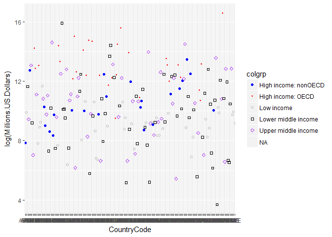
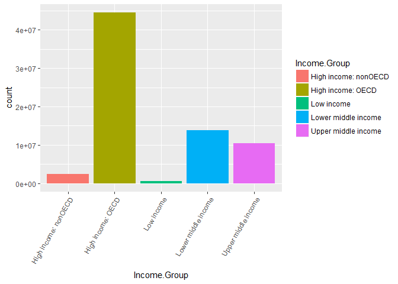

# Case Study of countries GDP


## Presented by Michael Toolin, Venkat Kasarla and Jaime Villanueva
#Introduction
A series of questions were presented regarding GDP data of a number of countries.  The data was provided in two different data sets.  After the data is cleaned and merged, several specific questions are asked that we will answer through some analysis of the data.

<br>

### Gathering the Data

```r
dfgdp_2012_final <- read.csv('../data/dfgdp_2012_final.csv', stringsAsFactors = FALSE)
edstats_final <- read.csv('../data/edstats_final.csv', stringsAsFactors = FALSE)
NumMatches <- inner_join(dfgdp_2012_final,edstats_final)%>% summarise(cnt=n())%>% as.numeric()
```

```
## Joining, by = "CountryCode"
```
<br>

### Cleaning Raw Source Files:

```r
print("source(source/raw_analysis_GDP.R)")
```

```
## [1] "source(source/raw_analysis_GDP.R)"
```

<br>

#### raw_analysis_GDP.R

```r
#gdp_2012 <- read.csv("data/gdp.csv", skip=4, 
#          na.strings = c("","NA"), stringsAsFactors = FALSE)   # Re-read data skipping header
#dfgdp_2012 <- tbl_df(gdp_2012)                                 # Create data frame 
#names(dfgdp_2012)                                              # Check column names
#sapply(dfgdp_2012, function(x) all(is.na(x)))                  # Check for columns with no data
```
This code reads the raw data in and inspects it in preparation for cleaning. Five columns were found empty and *X.5* on further inspection was not data but notations.

<br>


```r
#dfgdp_2012_clean1 <- select(dfgdp_2012, "CountryCode" = X, Ranking = X.1, Country = X.3,  # Select and   
#                            "Millions.US.Dollars" = X.4)                                  # rename columns 
#                                                                                          # 1,2,4, and 5
#dfgdp_2012_clean2 <- filter(dfgdp_2012_clean1, !is.na(Ranking) &                  # Filter out any 
#                            !is.na(CountryCode))                                  # line without a
#                                                                                  # country code and ranking
#dfgdp_2012_clean2$"Millions.US.Dollars" <-                                         # Get rid of the commas 
#                            gsub(",", "", dfgdp_2012_clean2$"Millions.US.Dollars") # in the 
#                                                                                   # "Millions.US.Dollars" 
#dfgdp_2012_clean2$Ranking <- as.numeric(dfgdp_2012_clean2$Ranking)                 # Convert Ranking and 
#dfgdp_2012_clean2$"Millions.US.Dollars" <-                                         # Millions.US.Dollars 
#                            as.numeric(dfgdp_2012_clean2$"Millions.US.Dollars")    # columns to numeric
```
The select function was used to filter out the data columns. Commas had to be removed from the *Millions.US.Dollars* column, and then the number columns were cast to numerics.

<br>


```r
print("source(source/raw_analysis_EDSTATS.R)")
```

```
## [1] "source(source/raw_analysis_EDSTATS.R)"
```

<br>

#### raw_analysis_EDSTATS.R

```r
#edstats <- read.csv("data/edstats_country.csv", na.strings = c("","NA"),             # Read in files and 
#                    stringsAsFactors = FALSE)                                        # and fill blanks 
#dfgdp_edstats <- read.csv("data/dfgdp_2012_final.csv", stringsAsFactors = FALSE)     # with NA
```
This code reads in and inspects the files in preparation for cleaning.

<br>


```r
#matched.result <- match(edstats$CountryCode, dfgdp_edstats$CountryCode)     # Creates vector holding line 
#                                                                            # number(s) if matched edstats
#                                                                            # and NAs if not matched
#edstats_final <- data.frame(stringsAsFactors = FALSE)                       # Initialize empty data frame
#
#
#for (x in 1:length(matched.result)){                                      # Iterate through matched.result 
#       ifelse (is.na(matched.result[x]),"NA", edstats_final <-            # if not NA, tack row onto
#                 rbind(edstats_final, edstats[x,]))                       # edstats_final
#}
```
The country codes for the first columns are compared, and the result of the comparison is put into the vector *matched.result* with matches showing the line number of the row in *edstats* that matches. Non-matches show an NA. The for loop checks *matched.result* skipping over NA's and adds the *edstats* row of the encountered line numbers to *edstats_final.* This ensures that the only countries left in *edstats_final* are countries with GDP data.

<br>

### Merging Files and Cleaning the Merged File

```r
print("source(source/merged.R)")
```

```
## [1] "source(source/merged.R)"
```

<br>

#### merged.R

```r
#dfgdp_2012_prepmerge <- read.csv("data/dfgdp_2012_final.csv", stringsAsFactors = FALSE)
#edstats_prepmerge <- read.csv("data/edstats_final.csv", stringsAsFactors = FALSE)
#no_match <- which(!(dfgdp_2012_prepmerge$CountryCode %in%       # Check if any countries from dfgdp are  
#                      edstats_prepmerge$CountryCode))           # not in EDSTATS by CountryCode          
#                                                                # Holds line number(s) of country code(s) 
#                                                                # with no match
#add <- dfgdp_2012_prepmerge$CountryCode[no_match]               # Extracts value(s) of country code(s) 
#                                                                # with no match
```
After reading the data, the country codes are compared for both data frames to see if there are any countries in the *dfgdp_2012_prepmerge* that are not in *edstats_prepmerge$CountryCode*. The line number(s) without a match are stored, and the country code value(s) at that number(s) is stored in *add*.

<br>


```r
#edstats_prepmerge_dup <- edstats_prepmerge                    
#add.nomatch.vectors <- matrix(add, nrow = length(add),ncol =    # Create matrix with with each 
#                        length(edstats_prepmerge_dup))          # column being vector to be added to 
#                                                                # edstats_prepmerge_dup
#for (x in 1:length(add)){                                             # For every country not matched,
#  add.nomatch.vectors[x, 2:length(edstats_prepmerge_dup)] <- "NA"     # fill vector with "NA" after 
#                        edstats_prepmerge_dup <-                      # country code and bind the 
#                        rbind(edstats_prepmerge_dup,                  # vector as new row on              
#                        add.nomatch.vectors[x,])                      # edstats_prepmerge_dup              
#}
#merged1 <- merge(dfgdp_2012_prepmerge, edstats_prepmerge_dup, by="CountryCode")  # Merge by country code
```
The matrix, *add.nomatch.vectors*, is created with one vector for each country code present in *add*. The country code is repeated for each indice in the vector. The for loop does two things: it fills the rest of the vector after the country code with NA, and then it tacks that row onto the bottom of *edstats_prepmerge_dup*. Then this data frame is merged with the other.

<br>


```r
print("source(source/cleaned_merged.R)")
```

```
## [1] "source(source/cleaned_merged.R)"
```

<br>

#### cleaned_merged.R

```r
#merged_final <- read.csv("data/merged_final.csv", stringsAsFactors = FALSE)       
#cleaned_merged1 <- select(merged_final, "CountryCode", "Country", "Ranking",       # Select desired columns
#                          "Millions.US.Dollars", "Income.Group")
#cleaned_merged_final <- arrange(cleaned_merged1, CountryCode)                      # Perform final merge
```
This code selects out the necessary columns to answer the questions in the case study.

<br>

#### Question 1
The first question presented was how many ID's in the two data sets matched.  

```r
cat("There were",NumMatches,"found to be the same in the data sets \n")
```

```
## There were 189 found to be the same in the data sets
```
#### Question 2
The second question is find out the 13th Country when ordered by GDP in ascending order

```r
cleaned_merged1 <- read.csv('../data/cleaned_merged_final.csv')
arrangByUSD <- arrange(cleaned_merged1, Millions.US.Dollars)
cat("The 13th country in the ascending GDP rankings is",arrangByUSD$Country[13]%>%as.character(),"\n")
```

```
## The 13th country in the ascending GDP rankings is St. Kitts and Nevis
```
#### Question 3
The third question presented was to find the average GDP rankings for the **High Income:OECD** group and the **High Income:nonOECD** group.

```r
###############################################################
#                                                             #
# Coerce some of the data to proper classes so Income.Group   #
# can be filtered by High Income OECD and High Income:nonOECD #
# Apply the filter and get the average rankings of each group #
#                                                             #
###############################################################
cleaned_merged1 %>% filter(Income.Group %in% c("High income: OECD" , "High income: nonOECD")) %>%
  group_by(Income.Group) %>% 
  summarise( average = mean(Ranking)) %>% 
  mutate_if(is.factor, as.character) %>% 
  as.data.frame(as.matrix(),stringsAsFactors=F)
```

```
##           Income.Group  average
## 1 High income: nonOECD 91.91304
## 2    High income: OECD 32.96667
```
The difference in mean of High Income:nonOECD vs. High Income:OECD is \$59 million. High Income:nonOECD increases by \$1.79 million for every million High Income:OECD increases.

#### Question 4
Below is a scatter plot and bar graph for **GDP of all countries** 
by Income Group:

```r
#
# Build a scatter chart of GDP vs Income Group
#
colgrp <- cleaned_merged1$Income.Group
ggplot(cleaned_merged1, aes(x=CountryCode, y=log(Millions.US.Dollars), group=colgrp,shape=colgrp)) + geom_point(aes(colour=colgrp)) + scale_shape_manual(values=c(19,20,21,22,23))+scale_colour_manual(values=c("blue", "red","gray","black","purple"))
```

```
## Warning: Removed 1 rows containing missing values (geom_point).
```

<!-- -->

```r
#
# Build Bar chart of GDP by Income Group
#
g<-ggplot(data=(subset(cleaned_merged1, !is.na(Income.Group))), aes(Income.Group))
g + geom_bar(aes(weight=Millions.US.Dollars, fill=Income.Group)) +theme(axis.text.x = element_text(angle=60, hjust=1))
```

<!-- -->
<br>

#### Question 5
The table below displays the GDP rankings seperated into 5 different groups.

```r
#
# Read the data from the file and seperate into quantiles
#
Cleaned.Merged.Analysis <- read.csv('../data/cleaned_merged_final.csv', stringsAsFactors = FALSE)
quantile(Cleaned.Merged.Analysis$Ranking, seq(0, 1, length=6))
```

```
##    0%   20%   40%   60%   80%  100% 
##   1.0  38.8  76.6 114.4 152.2 190.0
```
Here we can see that 20% of the countries are ranked below 39.  This means the top 20% of the countries by GDP are ranked from 1 to 38.  The bottom 20% are ranked below 152.  This means 60%, over half, of the ranked countries have a rank from 39 to 151.

<br>

There are five countres in the Lower Middle Income group but rank higher than 39 on the GDP list

```r
Income.Group_table <- Cleaned.Merged.Analysis
Income.Group_table <- Income.Group_table[c("Income.Group", "CountryCode", "Country", "Ranking", "Millions.US.Dollars")]
###############################################################
#                                                             #
# Build the data frame sorted by Income group                 #
# Iterate through the Income.Group vector and skips all NA    #
# Group by numbers so we can explictly sort in ways we want:  #
#    1: High Income: OECD                                     #
#    2: High Income nonOECD                                   #
#    3: Upper Middle Income                                   #
#    4: Lower Middle Income                                   #
#    5: Low Income                                            #
#                                                             #
###############################################################
for (x in 1:length(Income.Group_table$Income.Group)){
ifelse(is.na(Income.Group_table$Income.Group[x]),Income.Group_table<-Income.Group_table[-x,],"NA")
ifelse(Income.Group_table$Income.Group[x]=="Lower middle income", Income.Group_table$newcolumn[x]<-4,"NA")
ifelse(Income.Group_table$Income.Group[x]=="Upper middle income", Income.Group_table$newcolumn[x]<-3,"NA")
ifelse(Income.Group_table$Income.Group[x]=="Low income", Income.Group_table$newcolumn[x]<-5,"NA")
ifelse(Income.Group_table$Income.Group[x]=="High income: OECD", Income.Group_table$newcolumn[x]<-1,"NA")
ifelse(Income.Group_table$Income.Group[x]=="High income: nonOECD", Income.Group_table$newcolumn[x]<-2,"NA")
}

sorted.Income.Group_table <- arrange(Income.Group_table, newcolumn, desc(Millions.US.Dollars))
sorted.Income.Group_table <- sorted.Income.Group_table[-6]
filter(sorted.Income.Group_table,sorted.Income.Group_table$Income.Group == "Lower middle income", Ranking < 39)
```

```
##          Income.Group CountryCode          Country Ranking
## 1 Lower middle income         CHN            China       2
## 2 Lower middle income         IND            India      10
## 3 Lower middle income         IDN        Indonesia      16
## 4 Lower middle income         THA         Thailand      31
## 5 Lower middle income         EGY Egypt, Arab Rep.      38
##   Millions.US.Dollars
## 1             8227103
## 2             1841710
## 3              878043
## 4              365966
## 5              262832
```


```r
writeLines("td, th { padding : 6px } th { background-color : brown ; color : white; border : 1px solid white; } td { color : brown ; border : 1px solid brown }", con = "mystyle.css")
dset1 <- tail(sorted.Income.Group_table,-98)
knitr::kable(dset1, format = "html")
```

<table>
 <thead>
  <tr>
   <th style="text-align:left;">   </th>
   <th style="text-align:left;"> Income.Group </th>
   <th style="text-align:left;"> CountryCode </th>
   <th style="text-align:left;"> Country </th>
   <th style="text-align:right;"> Ranking </th>
   <th style="text-align:right;"> Millions.US.Dollars </th>
  </tr>
 </thead>
<tbody>
  <tr>
   <td style="text-align:left;"> 99 </td>
   <td style="text-align:left;"> Lower middle income </td>
   <td style="text-align:left;"> CHN </td>
   <td style="text-align:left;"> China </td>
   <td style="text-align:right;"> 2 </td>
   <td style="text-align:right;"> 8227103 </td>
  </tr>
  <tr>
   <td style="text-align:left;"> 100 </td>
   <td style="text-align:left;"> Lower middle income </td>
   <td style="text-align:left;"> IND </td>
   <td style="text-align:left;"> India </td>
   <td style="text-align:right;"> 10 </td>
   <td style="text-align:right;"> 1841710 </td>
  </tr>
  <tr>
   <td style="text-align:left;"> 101 </td>
   <td style="text-align:left;"> Lower middle income </td>
   <td style="text-align:left;"> IDN </td>
   <td style="text-align:left;"> Indonesia </td>
   <td style="text-align:right;"> 16 </td>
   <td style="text-align:right;"> 878043 </td>
  </tr>
  <tr>
   <td style="text-align:left;"> 102 </td>
   <td style="text-align:left;"> Lower middle income </td>
   <td style="text-align:left;"> THA </td>
   <td style="text-align:left;"> Thailand </td>
   <td style="text-align:right;"> 31 </td>
   <td style="text-align:right;"> 365966 </td>
  </tr>
  <tr>
   <td style="text-align:left;"> 103 </td>
   <td style="text-align:left;"> Lower middle income </td>
   <td style="text-align:left;"> EGY </td>
   <td style="text-align:left;"> Egypt, Arab Rep. </td>
   <td style="text-align:right;"> 38 </td>
   <td style="text-align:right;"> 262832 </td>
  </tr>
  <tr>
   <td style="text-align:left;"> 104 </td>
   <td style="text-align:left;"> Lower middle income </td>
   <td style="text-align:left;"> NGA </td>
   <td style="text-align:left;"> Nigeria </td>
   <td style="text-align:right;"> 39 </td>
   <td style="text-align:right;"> 262597 </td>
  </tr>
  <tr>
   <td style="text-align:left;"> 105 </td>
   <td style="text-align:left;"> Lower middle income </td>
   <td style="text-align:left;"> PHL </td>
   <td style="text-align:left;"> Philippines </td>
   <td style="text-align:right;"> 41 </td>
   <td style="text-align:right;"> 250182 </td>
  </tr>
  <tr>
   <td style="text-align:left;"> 106 </td>
   <td style="text-align:left;"> Lower middle income </td>
   <td style="text-align:left;"> PAK </td>
   <td style="text-align:left;"> Pakistan </td>
   <td style="text-align:right;"> 44 </td>
   <td style="text-align:right;"> 225143 </td>
  </tr>
  <tr>
   <td style="text-align:left;"> 107 </td>
   <td style="text-align:left;"> Lower middle income </td>
   <td style="text-align:left;"> IRQ </td>
   <td style="text-align:left;"> Iraq </td>
   <td style="text-align:right;"> 47 </td>
   <td style="text-align:right;"> 210280 </td>
  </tr>
  <tr>
   <td style="text-align:left;"> 108 </td>
   <td style="text-align:left;"> Lower middle income </td>
   <td style="text-align:left;"> UKR </td>
   <td style="text-align:left;"> Ukraine </td>
   <td style="text-align:right;"> 53 </td>
   <td style="text-align:right;"> 176309 </td>
  </tr>
  <tr>
   <td style="text-align:left;"> 109 </td>
   <td style="text-align:left;"> Lower middle income </td>
   <td style="text-align:left;"> VNM </td>
   <td style="text-align:left;"> Vietnam </td>
   <td style="text-align:right;"> 57 </td>
   <td style="text-align:right;"> 155820 </td>
  </tr>
  <tr>
   <td style="text-align:left;"> 110 </td>
   <td style="text-align:left;"> Lower middle income </td>
   <td style="text-align:left;"> AGO </td>
   <td style="text-align:left;"> Angola </td>
   <td style="text-align:right;"> 60 </td>
   <td style="text-align:right;"> 114147 </td>
  </tr>
  <tr>
   <td style="text-align:left;"> 111 </td>
   <td style="text-align:left;"> Lower middle income </td>
   <td style="text-align:left;"> MAR </td>
   <td style="text-align:left;"> Morocco </td>
   <td style="text-align:right;"> 62 </td>
   <td style="text-align:right;"> 95982 </td>
  </tr>
  <tr>
   <td style="text-align:left;"> 112 </td>
   <td style="text-align:left;"> Lower middle income </td>
   <td style="text-align:left;"> ECU </td>
   <td style="text-align:left;"> Ecuador </td>
   <td style="text-align:right;"> 64 </td>
   <td style="text-align:right;"> 84040 </td>
  </tr>
  <tr>
   <td style="text-align:left;"> 113 </td>
   <td style="text-align:left;"> Lower middle income </td>
   <td style="text-align:left;"> SYR </td>
   <td style="text-align:left;"> Syrian Arab Republic </td>
   <td style="text-align:right;"> 65 </td>
   <td style="text-align:right;"> 73672 </td>
  </tr>
  <tr>
   <td style="text-align:left;"> 114 </td>
   <td style="text-align:left;"> Lower middle income </td>
   <td style="text-align:left;"> LKA </td>
   <td style="text-align:left;"> Sri Lanka </td>
   <td style="text-align:right;"> 70 </td>
   <td style="text-align:right;"> 59423 </td>
  </tr>
  <tr>
   <td style="text-align:left;"> 115 </td>
   <td style="text-align:left;"> Lower middle income </td>
   <td style="text-align:left;"> SDN </td>
   <td style="text-align:left;"> Sudan </td>
   <td style="text-align:right;"> 73 </td>
   <td style="text-align:right;"> 58769 </td>
  </tr>
  <tr>
   <td style="text-align:left;"> 116 </td>
   <td style="text-align:left;"> Lower middle income </td>
   <td style="text-align:left;"> UZB </td>
   <td style="text-align:left;"> Uzbekistan </td>
   <td style="text-align:right;"> 75 </td>
   <td style="text-align:right;"> 51113 </td>
  </tr>
  <tr>
   <td style="text-align:left;"> 117 </td>
   <td style="text-align:left;"> Lower middle income </td>
   <td style="text-align:left;"> GTM </td>
   <td style="text-align:left;"> Guatemala </td>
   <td style="text-align:right;"> 77 </td>
   <td style="text-align:right;"> 50234 </td>
  </tr>
  <tr>
   <td style="text-align:left;"> 118 </td>
   <td style="text-align:left;"> Lower middle income </td>
   <td style="text-align:left;"> TUN </td>
   <td style="text-align:left;"> Tunisia </td>
   <td style="text-align:right;"> 79 </td>
   <td style="text-align:right;"> 45662 </td>
  </tr>
  <tr>
   <td style="text-align:left;"> 119 </td>
   <td style="text-align:left;"> Lower middle income </td>
   <td style="text-align:left;"> YEM </td>
   <td style="text-align:left;"> Yemen, Rep. </td>
   <td style="text-align:right;"> 90 </td>
   <td style="text-align:right;"> 35646 </td>
  </tr>
  <tr>
   <td style="text-align:left;"> 120 </td>
   <td style="text-align:left;"> Lower middle income </td>
   <td style="text-align:left;"> TKM </td>
   <td style="text-align:left;"> Turkmenistan </td>
   <td style="text-align:right;"> 91 </td>
   <td style="text-align:right;"> 35164 </td>
  </tr>
  <tr>
   <td style="text-align:left;"> 121 </td>
   <td style="text-align:left;"> Lower middle income </td>
   <td style="text-align:left;"> JOR </td>
   <td style="text-align:left;"> Jordan </td>
   <td style="text-align:right;"> 92 </td>
   <td style="text-align:right;"> 31015 </td>
  </tr>
  <tr>
   <td style="text-align:left;"> 122 </td>
   <td style="text-align:left;"> Lower middle income </td>
   <td style="text-align:left;"> BOL </td>
   <td style="text-align:left;"> Bolivia </td>
   <td style="text-align:right;"> 96 </td>
   <td style="text-align:right;"> 27035 </td>
  </tr>
  <tr>
   <td style="text-align:left;"> 123 </td>
   <td style="text-align:left;"> Lower middle income </td>
   <td style="text-align:left;"> PRY </td>
   <td style="text-align:left;"> Paraguay </td>
   <td style="text-align:right;"> 97 </td>
   <td style="text-align:right;"> 25502 </td>
  </tr>
  <tr>
   <td style="text-align:left;"> 124 </td>
   <td style="text-align:left;"> Lower middle income </td>
   <td style="text-align:left;"> CMR </td>
   <td style="text-align:left;"> Cameroon </td>
   <td style="text-align:right;"> 98 </td>
   <td style="text-align:right;"> 25322 </td>
  </tr>
  <tr>
   <td style="text-align:left;"> 125 </td>
   <td style="text-align:left;"> Lower middle income </td>
   <td style="text-align:left;"> CIV </td>
   <td style="text-align:left;"> Côte d'Ivoire </td>
   <td style="text-align:right;"> 99 </td>
   <td style="text-align:right;"> 24680 </td>
  </tr>
  <tr>
   <td style="text-align:left;"> 126 </td>
   <td style="text-align:left;"> Lower middle income </td>
   <td style="text-align:left;"> SLV </td>
   <td style="text-align:left;"> El Salvador </td>
   <td style="text-align:right;"> 100 </td>
   <td style="text-align:right;"> 23864 </td>
  </tr>
  <tr>
   <td style="text-align:left;"> 127 </td>
   <td style="text-align:left;"> Lower middle income </td>
   <td style="text-align:left;"> HND </td>
   <td style="text-align:left;"> Honduras </td>
   <td style="text-align:right;"> 108 </td>
   <td style="text-align:right;"> 18434 </td>
  </tr>
  <tr>
   <td style="text-align:left;"> 128 </td>
   <td style="text-align:left;"> Lower middle income </td>
   <td style="text-align:left;"> GEO </td>
   <td style="text-align:left;"> Georgia </td>
   <td style="text-align:right;"> 114 </td>
   <td style="text-align:right;"> 15747 </td>
  </tr>
  <tr>
   <td style="text-align:left;"> 129 </td>
   <td style="text-align:left;"> Lower middle income </td>
   <td style="text-align:left;"> PNG </td>
   <td style="text-align:left;"> Papua New Guinea </td>
   <td style="text-align:right;"> 115 </td>
   <td style="text-align:right;"> 15654 </td>
  </tr>
  <tr>
   <td style="text-align:left;"> 130 </td>
   <td style="text-align:left;"> Lower middle income </td>
   <td style="text-align:left;"> SEN </td>
   <td style="text-align:left;"> Senegal </td>
   <td style="text-align:right;"> 119 </td>
   <td style="text-align:right;"> 14046 </td>
  </tr>
  <tr>
   <td style="text-align:left;"> 131 </td>
   <td style="text-align:left;"> Lower middle income </td>
   <td style="text-align:left;"> COG </td>
   <td style="text-align:left;"> Congo, Rep. </td>
   <td style="text-align:right;"> 121 </td>
   <td style="text-align:right;"> 13678 </td>
  </tr>
  <tr>
   <td style="text-align:left;"> 132 </td>
   <td style="text-align:left;"> Lower middle income </td>
   <td style="text-align:left;"> NIC </td>
   <td style="text-align:left;"> Nicaragua </td>
   <td style="text-align:right;"> 126 </td>
   <td style="text-align:right;"> 10507 </td>
  </tr>
  <tr>
   <td style="text-align:left;"> 133 </td>
   <td style="text-align:left;"> Lower middle income </td>
   <td style="text-align:left;"> MNG </td>
   <td style="text-align:left;"> Mongolia </td>
   <td style="text-align:right;"> 130 </td>
   <td style="text-align:right;"> 10271 </td>
  </tr>
  <tr>
   <td style="text-align:left;"> 134 </td>
   <td style="text-align:left;"> Lower middle income </td>
   <td style="text-align:left;"> ARM </td>
   <td style="text-align:left;"> Armenia </td>
   <td style="text-align:right;"> 133 </td>
   <td style="text-align:right;"> 9951 </td>
  </tr>
  <tr>
   <td style="text-align:left;"> 135 </td>
   <td style="text-align:left;"> Lower middle income </td>
   <td style="text-align:left;"> MDA </td>
   <td style="text-align:left;"> Moldova </td>
   <td style="text-align:right;"> 141 </td>
   <td style="text-align:right;"> 7253 </td>
  </tr>
  <tr>
   <td style="text-align:left;"> 136 </td>
   <td style="text-align:left;"> Lower middle income </td>
   <td style="text-align:left;"> KSV </td>
   <td style="text-align:left;"> Kosovo </td>
   <td style="text-align:right;"> 146 </td>
   <td style="text-align:right;"> 6445 </td>
  </tr>
  <tr>
   <td style="text-align:left;"> 137 </td>
   <td style="text-align:left;"> Lower middle income </td>
   <td style="text-align:left;"> SWZ </td>
   <td style="text-align:left;"> Swaziland </td>
   <td style="text-align:right;"> 158 </td>
   <td style="text-align:right;"> 3744 </td>
  </tr>
  <tr>
   <td style="text-align:left;"> 138 </td>
   <td style="text-align:left;"> Lower middle income </td>
   <td style="text-align:left;"> GUY </td>
   <td style="text-align:left;"> Guyana </td>
   <td style="text-align:right;"> 160 </td>
   <td style="text-align:right;"> 2851 </td>
  </tr>
  <tr>
   <td style="text-align:left;"> 139 </td>
   <td style="text-align:left;"> Lower middle income </td>
   <td style="text-align:left;"> LSO </td>
   <td style="text-align:left;"> Lesotho </td>
   <td style="text-align:right;"> 163 </td>
   <td style="text-align:right;"> 2448 </td>
  </tr>
  <tr>
   <td style="text-align:left;"> 140 </td>
   <td style="text-align:left;"> Lower middle income </td>
   <td style="text-align:left;"> MDV </td>
   <td style="text-align:left;"> Maldives </td>
   <td style="text-align:right;"> 164 </td>
   <td style="text-align:right;"> 2222 </td>
  </tr>
  <tr>
   <td style="text-align:left;"> 141 </td>
   <td style="text-align:left;"> Lower middle income </td>
   <td style="text-align:left;"> CPV </td>
   <td style="text-align:left;"> Cape Verde </td>
   <td style="text-align:right;"> 166 </td>
   <td style="text-align:right;"> 1827 </td>
  </tr>
  <tr>
   <td style="text-align:left;"> 142 </td>
   <td style="text-align:left;"> Lower middle income </td>
   <td style="text-align:left;"> BTN </td>
   <td style="text-align:left;"> Bhutan </td>
   <td style="text-align:right;"> 167 </td>
   <td style="text-align:right;"> 1780 </td>
  </tr>
  <tr>
   <td style="text-align:left;"> 143 </td>
   <td style="text-align:left;"> Lower middle income </td>
   <td style="text-align:left;"> BLZ </td>
   <td style="text-align:left;"> Belize </td>
   <td style="text-align:right;"> 169 </td>
   <td style="text-align:right;"> 1493 </td>
  </tr>
  <tr>
   <td style="text-align:left;"> 144 </td>
   <td style="text-align:left;"> Lower middle income </td>
   <td style="text-align:left;"> TMP </td>
   <td style="text-align:left;"> Timor-Leste </td>
   <td style="text-align:right;"> 170 </td>
   <td style="text-align:right;"> 1293 </td>
  </tr>
  <tr>
   <td style="text-align:left;"> 145 </td>
   <td style="text-align:left;"> Lower middle income </td>
   <td style="text-align:left;"> VUT </td>
   <td style="text-align:left;"> Vanuatu </td>
   <td style="text-align:right;"> 177 </td>
   <td style="text-align:right;"> 787 </td>
  </tr>
  <tr>
   <td style="text-align:left;"> 146 </td>
   <td style="text-align:left;"> Lower middle income </td>
   <td style="text-align:left;"> WSM </td>
   <td style="text-align:left;"> Samoa </td>
   <td style="text-align:right;"> 181 </td>
   <td style="text-align:right;"> 684 </td>
  </tr>
  <tr>
   <td style="text-align:left;"> 147 </td>
   <td style="text-align:left;"> Lower middle income </td>
   <td style="text-align:left;"> TON </td>
   <td style="text-align:left;"> Tonga </td>
   <td style="text-align:right;"> 184 </td>
   <td style="text-align:right;"> 472 </td>
  </tr>
  <tr>
   <td style="text-align:left;"> 148 </td>
   <td style="text-align:left;"> Lower middle income </td>
   <td style="text-align:left;"> FSM </td>
   <td style="text-align:left;"> Micronesia, Fed. Sts. </td>
   <td style="text-align:right;"> 185 </td>
   <td style="text-align:right;"> 326 </td>
  </tr>
  <tr>
   <td style="text-align:left;"> 149 </td>
   <td style="text-align:left;"> Lower middle income </td>
   <td style="text-align:left;"> STP </td>
   <td style="text-align:left;"> São Tomé and Principe </td>
   <td style="text-align:right;"> 186 </td>
   <td style="text-align:right;"> 263 </td>
  </tr>
  <tr>
   <td style="text-align:left;"> 150 </td>
   <td style="text-align:left;"> Lower middle income </td>
   <td style="text-align:left;"> MHL </td>
   <td style="text-align:left;"> Marshall Islands </td>
   <td style="text-align:right;"> 188 </td>
   <td style="text-align:right;"> 182 </td>
  </tr>
  <tr>
   <td style="text-align:left;"> 151 </td>
   <td style="text-align:left;"> Lower middle income </td>
   <td style="text-align:left;"> KIR </td>
   <td style="text-align:left;"> Kiribati </td>
   <td style="text-align:right;"> 189 </td>
   <td style="text-align:right;"> 175 </td>
  </tr>
  <tr>
   <td style="text-align:left;"> 152 </td>
   <td style="text-align:left;"> Lower middle income </td>
   <td style="text-align:left;"> TUV </td>
   <td style="text-align:left;"> Tuvalu </td>
   <td style="text-align:right;"> 190 </td>
   <td style="text-align:right;"> 40 </td>
  </tr>
  <tr>
   <td style="text-align:left;"> 153 </td>
   <td style="text-align:left;"> Low income </td>
   <td style="text-align:left;"> BGD </td>
   <td style="text-align:left;"> Bangladesh </td>
   <td style="text-align:right;"> 59 </td>
   <td style="text-align:right;"> 116355 </td>
  </tr>
  <tr>
   <td style="text-align:left;"> 154 </td>
   <td style="text-align:left;"> Low income </td>
   <td style="text-align:left;"> ETH </td>
   <td style="text-align:left;"> Ethiopia </td>
   <td style="text-align:right;"> 85 </td>
   <td style="text-align:right;"> 41605 </td>
  </tr>
  <tr>
   <td style="text-align:left;"> 155 </td>
   <td style="text-align:left;"> Low income </td>
   <td style="text-align:left;"> GHA </td>
   <td style="text-align:left;"> Ghana </td>
   <td style="text-align:right;"> 86 </td>
   <td style="text-align:right;"> 40711 </td>
  </tr>
  <tr>
   <td style="text-align:left;"> 156 </td>
   <td style="text-align:left;"> Low income </td>
   <td style="text-align:left;"> KEN </td>
   <td style="text-align:left;"> Kenya </td>
   <td style="text-align:right;"> 87 </td>
   <td style="text-align:right;"> 40697 </td>
  </tr>
  <tr>
   <td style="text-align:left;"> 157 </td>
   <td style="text-align:left;"> Low income </td>
   <td style="text-align:left;"> TZA </td>
   <td style="text-align:left;"> Tanzania </td>
   <td style="text-align:right;"> 95 </td>
   <td style="text-align:right;"> 28242 </td>
  </tr>
  <tr>
   <td style="text-align:left;"> 158 </td>
   <td style="text-align:left;"> Low income </td>
   <td style="text-align:left;"> ZMB </td>
   <td style="text-align:left;"> Zambia </td>
   <td style="text-align:right;"> 104 </td>
   <td style="text-align:right;"> 20678 </td>
  </tr>
  <tr>
   <td style="text-align:left;"> 159 </td>
   <td style="text-align:left;"> Low income </td>
   <td style="text-align:left;"> AFG </td>
   <td style="text-align:left;"> Afghanistan </td>
   <td style="text-align:right;"> 105 </td>
   <td style="text-align:right;"> 20497 </td>
  </tr>
  <tr>
   <td style="text-align:left;"> 160 </td>
   <td style="text-align:left;"> Low income </td>
   <td style="text-align:left;"> UGA </td>
   <td style="text-align:left;"> Uganda </td>
   <td style="text-align:right;"> 106 </td>
   <td style="text-align:right;"> 19881 </td>
  </tr>
  <tr>
   <td style="text-align:left;"> 161 </td>
   <td style="text-align:left;"> Low income </td>
   <td style="text-align:left;"> NPL </td>
   <td style="text-align:left;"> Nepal </td>
   <td style="text-align:right;"> 107 </td>
   <td style="text-align:right;"> 18963 </td>
  </tr>
  <tr>
   <td style="text-align:left;"> 162 </td>
   <td style="text-align:left;"> Low income </td>
   <td style="text-align:left;"> ZAR </td>
   <td style="text-align:left;"> Congo, Dem. Rep. </td>
   <td style="text-align:right;"> 112 </td>
   <td style="text-align:right;"> 17204 </td>
  </tr>
  <tr>
   <td style="text-align:left;"> 163 </td>
   <td style="text-align:left;"> Low income </td>
   <td style="text-align:left;"> MOZ </td>
   <td style="text-align:left;"> Mozambique </td>
   <td style="text-align:right;"> 118 </td>
   <td style="text-align:right;"> 14244 </td>
  </tr>
  <tr>
   <td style="text-align:left;"> 164 </td>
   <td style="text-align:left;"> Low income </td>
   <td style="text-align:left;"> KHM </td>
   <td style="text-align:left;"> Cambodia </td>
   <td style="text-align:right;"> 120 </td>
   <td style="text-align:right;"> 14038 </td>
  </tr>
  <tr>
   <td style="text-align:left;"> 165 </td>
   <td style="text-align:left;"> Low income </td>
   <td style="text-align:left;"> TCD </td>
   <td style="text-align:left;"> Chad </td>
   <td style="text-align:right;"> 124 </td>
   <td style="text-align:right;"> 12887 </td>
  </tr>
  <tr>
   <td style="text-align:left;"> 166 </td>
   <td style="text-align:left;"> Low income </td>
   <td style="text-align:left;"> BFA </td>
   <td style="text-align:left;"> Burkina Faso </td>
   <td style="text-align:right;"> 128 </td>
   <td style="text-align:right;"> 10441 </td>
  </tr>
  <tr>
   <td style="text-align:left;"> 167 </td>
   <td style="text-align:left;"> Low income </td>
   <td style="text-align:left;"> MLI </td>
   <td style="text-align:left;"> Mali </td>
   <td style="text-align:right;"> 129 </td>
   <td style="text-align:right;"> 10308 </td>
  </tr>
  <tr>
   <td style="text-align:left;"> 168 </td>
   <td style="text-align:left;"> Low income </td>
   <td style="text-align:left;"> MDG </td>
   <td style="text-align:left;"> Madagascar </td>
   <td style="text-align:right;"> 132 </td>
   <td style="text-align:right;"> 9975 </td>
  </tr>
  <tr>
   <td style="text-align:left;"> 169 </td>
   <td style="text-align:left;"> Low income </td>
   <td style="text-align:left;"> ZWE </td>
   <td style="text-align:left;"> Zimbabwe </td>
   <td style="text-align:right;"> 134 </td>
   <td style="text-align:right;"> 9802 </td>
  </tr>
  <tr>
   <td style="text-align:left;"> 170 </td>
   <td style="text-align:left;"> Low income </td>
   <td style="text-align:left;"> LAO </td>
   <td style="text-align:left;"> Lao PDR </td>
   <td style="text-align:right;"> 136 </td>
   <td style="text-align:right;"> 9418 </td>
  </tr>
  <tr>
   <td style="text-align:left;"> 171 </td>
   <td style="text-align:left;"> Low income </td>
   <td style="text-align:left;"> HTI </td>
   <td style="text-align:left;"> Haiti </td>
   <td style="text-align:right;"> 139 </td>
   <td style="text-align:right;"> 7843 </td>
  </tr>
  <tr>
   <td style="text-align:left;"> 172 </td>
   <td style="text-align:left;"> Low income </td>
   <td style="text-align:left;"> BEN </td>
   <td style="text-align:left;"> Benin </td>
   <td style="text-align:right;"> 140 </td>
   <td style="text-align:right;"> 7557 </td>
  </tr>
  <tr>
   <td style="text-align:left;"> 173 </td>
   <td style="text-align:left;"> Low income </td>
   <td style="text-align:left;"> RWA </td>
   <td style="text-align:left;"> Rwanda </td>
   <td style="text-align:right;"> 142 </td>
   <td style="text-align:right;"> 7103 </td>
  </tr>
  <tr>
   <td style="text-align:left;"> 174 </td>
   <td style="text-align:left;"> Low income </td>
   <td style="text-align:left;"> TJK </td>
   <td style="text-align:left;"> Tajikistan </td>
   <td style="text-align:right;"> 143 </td>
   <td style="text-align:right;"> 6972 </td>
  </tr>
  <tr>
   <td style="text-align:left;"> 175 </td>
   <td style="text-align:left;"> Low income </td>
   <td style="text-align:left;"> NER </td>
   <td style="text-align:left;"> Niger </td>
   <td style="text-align:right;"> 144 </td>
   <td style="text-align:right;"> 6773 </td>
  </tr>
  <tr>
   <td style="text-align:left;"> 176 </td>
   <td style="text-align:left;"> Low income </td>
   <td style="text-align:left;"> KGZ </td>
   <td style="text-align:left;"> Kyrgyz Republic </td>
   <td style="text-align:right;"> 145 </td>
   <td style="text-align:right;"> 6475 </td>
  </tr>
  <tr>
   <td style="text-align:left;"> 177 </td>
   <td style="text-align:left;"> Low income </td>
   <td style="text-align:left;"> GIN </td>
   <td style="text-align:left;"> Guinea </td>
   <td style="text-align:right;"> 148 </td>
   <td style="text-align:right;"> 5632 </td>
  </tr>
  <tr>
   <td style="text-align:left;"> 178 </td>
   <td style="text-align:left;"> Low income </td>
   <td style="text-align:left;"> MWI </td>
   <td style="text-align:left;"> Malawi </td>
   <td style="text-align:right;"> 152 </td>
   <td style="text-align:right;"> 4264 </td>
  </tr>
  <tr>
   <td style="text-align:left;"> 179 </td>
   <td style="text-align:left;"> Low income </td>
   <td style="text-align:left;"> MRT </td>
   <td style="text-align:left;"> Mauritania </td>
   <td style="text-align:right;"> 154 </td>
   <td style="text-align:right;"> 4199 </td>
  </tr>
  <tr>
   <td style="text-align:left;"> 180 </td>
   <td style="text-align:left;"> Low income </td>
   <td style="text-align:left;"> TGO </td>
   <td style="text-align:left;"> Togo </td>
   <td style="text-align:right;"> 156 </td>
   <td style="text-align:right;"> 3814 </td>
  </tr>
  <tr>
   <td style="text-align:left;"> 181 </td>
   <td style="text-align:left;"> Low income </td>
   <td style="text-align:left;"> SLE </td>
   <td style="text-align:left;"> Sierra Leone </td>
   <td style="text-align:right;"> 157 </td>
   <td style="text-align:right;"> 3796 </td>
  </tr>
  <tr>
   <td style="text-align:left;"> 182 </td>
   <td style="text-align:left;"> Low income </td>
   <td style="text-align:left;"> ERI </td>
   <td style="text-align:left;"> Eritrea </td>
   <td style="text-align:right;"> 159 </td>
   <td style="text-align:right;"> 3092 </td>
  </tr>
  <tr>
   <td style="text-align:left;"> 183 </td>
   <td style="text-align:left;"> Low income </td>
   <td style="text-align:left;"> BDI </td>
   <td style="text-align:left;"> Burundi </td>
   <td style="text-align:right;"> 162 </td>
   <td style="text-align:right;"> 2472 </td>
  </tr>
  <tr>
   <td style="text-align:left;"> 184 </td>
   <td style="text-align:left;"> Low income </td>
   <td style="text-align:left;"> CAF </td>
   <td style="text-align:left;"> Central African Republic </td>
   <td style="text-align:right;"> 165 </td>
   <td style="text-align:right;"> 2184 </td>
  </tr>
  <tr>
   <td style="text-align:left;"> 185 </td>
   <td style="text-align:left;"> Low income </td>
   <td style="text-align:left;"> LBR </td>
   <td style="text-align:left;"> Liberia </td>
   <td style="text-align:right;"> 168 </td>
   <td style="text-align:right;"> 1734 </td>
  </tr>
  <tr>
   <td style="text-align:left;"> 186 </td>
   <td style="text-align:left;"> Low income </td>
   <td style="text-align:left;"> SLB </td>
   <td style="text-align:left;"> Solomon Islands </td>
   <td style="text-align:right;"> 174 </td>
   <td style="text-align:right;"> 1008 </td>
  </tr>
  <tr>
   <td style="text-align:left;"> 187 </td>
   <td style="text-align:left;"> Low income </td>
   <td style="text-align:left;"> GMB </td>
   <td style="text-align:left;"> Gambia, The </td>
   <td style="text-align:right;"> 175 </td>
   <td style="text-align:right;"> 917 </td>
  </tr>
  <tr>
   <td style="text-align:left;"> 188 </td>
   <td style="text-align:left;"> Low income </td>
   <td style="text-align:left;"> GNB </td>
   <td style="text-align:left;"> Guinea-Bissau </td>
   <td style="text-align:right;"> 176 </td>
   <td style="text-align:right;"> 822 </td>
  </tr>
  <tr>
   <td style="text-align:left;"> 189 </td>
   <td style="text-align:left;"> Low income </td>
   <td style="text-align:left;"> COM </td>
   <td style="text-align:left;"> Comoros </td>
   <td style="text-align:right;"> 182 </td>
   <td style="text-align:right;"> 596 </td>
  </tr>
</tbody>
</table>
# Conclusion
We compared GDP across five income groups.  We found that most of the countries fall into the High Income or Upper Middle groups.  We also found Income Rank is not an indication of GDP.  Five countries in the Lower Income group were inside the top 40 of GDP.

<br><br><br>


